# Phase 2: Complete Seed Flow & Entity Relationships

## Overview

This document visualizes the complete data model and seed flow for the MoodBoard Phase 2 implementation, including texture entities, categorized images, and the full generation pipeline.

---

## 1. Database Schema & Entity Relationships

---

## 2. Texture Entity System (Phase 2)

```mermaid
graph TB
    subgraph "Texture Categories (5)"
        TC1[Wall Finishes<br/>גימורי קיר]
        TC2[Wood Finishes<br/>גימורי עץ]
        TC3[Metal Finishes<br/>גימורי מתכת]
        TC4[Fabric Textures<br/>טקסטורות בד]
        TC5[Stone Finishes<br/>גימורי אבן]
    end

    subgraph "Texture Types (27 total)"
        TC1 --> TT1[Matte<br/>מט]
        TC1 --> TT2[Glossy<br/>מבריק]
        TC1 --> TT3[Satin<br/>סאטן]
        TC1 --> TT4[Textured<br/>טקסטורה]
        TC1 --> TT5[Smooth<br/>חלק]

        TC2 --> TT6[Natural<br/>טבעי]
        TC2 --> TT7[Lacquered<br/>לכה]
        TC2 --> TT8[Brushed<br/>מוברש]
        TC2 --> TT9[Oiled<br/>שמן]

        TC3 --> TT10[Polished<br/>מבריק]
        TC3 --> TT11[Brushed<br/>מוברש]
        TC3 --> TT12[Brass<br/>פליז]
        TC3 --> TT13[Copper<br/>נחושת]

        TC4 --> TT14[Smooth<br/>חלק]
        TC4 --> TT15[Woven<br/>אריגה]
        TC4 --> TT16[Velvet<br/>קטיפה]
        TC4 --> TT17[Leather<br/>עור]

        TC5 --> TT18[Polished<br/>מלוטש]
        TC5 --> TT19[Honed<br/>מחוספס]
        TC5 --> TT20[Concrete<br/>בטון]
    end

    subgraph "Texture Instances (Reusable)"
        T1[Oak Natural<br/>usage: 15]
        T2[Walnut Lacquered<br/>usage: 8]
        T3[Brass Polished<br/>usage: 23]
        T4[Velvet Soft<br/>usage: 12]
        T5[Marble Polished<br/>usage: 19]
    end

    TT6 --> T1
    TT7 --> T2
    TT12 --> T3
    TT16 --> T4
    TT18 --> T5

    subgraph "Design Styles Using Textures"
        DS1[Art Deco Modern<br/>in Gold<br/>LUXURY]
        DS2[Minimalist Zen<br/>in White<br/>REGULAR]
        DS3[Industrial Loft<br/>in Gray<br/>REGULAR]
    end

    T3 -.usage++.-> DS1
    T4 -.usage++.-> DS1
    T5 -.usage++.-> DS1

    T1 -.usage++.-> DS2
    T5 -.usage++.-> DS2

    T2 -.usage++.-> DS3
    T3 -.usage++.-> DS3

    style T1 fill:#e8f5e9
    style T2 fill:#e8f5e9
    style T3 fill:#fff3e0
    style T4 fill:#f3e5f5
    style T5 fill:#e3f2fd
```

---

## 3. Complete Seed Flow (Phase 2)

```mermaid
flowchart TD
    Start([Start Seed Process]) --> LoadData[Load Database Entities]

    LoadData --> LoadSub[Load SubCategories]
    LoadData --> LoadApp[Load Approaches]
    LoadData --> LoadCol[Load Colors]
    LoadData --> LoadRoom[Load RoomTypes 24]
    LoadData --> LoadTex[Load Texture Categories]

    LoadSub --> Filter[Filter Pending SubCategories<br/>Skip already generated]
    Filter --> SelectPrice{Price Level Mode}

    SelectPrice -->|REGULAR| SetRegular[priceLevel = REGULAR]
    SelectPrice -->|LUXURY| SetLuxury[priceLevel = LUXURY]
    SelectPrice -->|RANDOM| SetRandom[Random 50/50]

    SetRegular --> AISelect
    SetLuxury --> AISelect
    SetRandom --> AISelect

    AISelect[AI Selection:<br/>Optimal Approach + Color] --> LoopStyles{For Each<br/>SubCategory}

    LoopStyles -->|Next| Act1[🎭 Act 1: The Script<br/>Generate Hybrid Content]

    Act1 --> GenPoetic[Generate Poetic Intro<br/>buildPoeticIntroPrompt]
    GenPoetic --> GenFactual[Generate Factual Details<br/>buildFactualDetailsPrompt<br/>+ price level keywords]

    GenFactual --> ExtractContent{Extract from Content}
    ExtractContent --> GetMaterials[requiredMaterials<br/>15-25 items]
    ExtractContent --> GetColors[requiredColors<br/>10-15 items]
    ExtractContent --> GetGuidance[materialGuidance<br/>descriptive text]

    GetMaterials --> Act2
    GetColors --> Act2
    GetGuidance --> Act2

    Act2[🧱 Act 2: Asset Prep<br/>Ensure Materials/Colors Exist] --> CreateStyle[💾 Create Style Record<br/>with priceLevel]

    CreateStyle --> Act3[🖼️ Act 3: Golden Scenes<br/>Generate 6 Scene Images]
    Act3 --> GoldenScenes[6 varied scene images<br/>with complementary colors]
    GoldenScenes --> SaveGallery[Save to style.gallery]

    SaveGallery --> Act35[🧱 Act 3.5: Texture Generation<br/>NEW PHASE 2]

    subgraph "Texture Generation Flow"
        Act35 --> ParseMat[Parse materialGuidance<br/>Extract materials + finishes]
        ParseMat --> MatchCat[Match to Texture Categories<br/>wall/wood/metal/fabric/stone]
        MatchCat --> FindTex{Texture<br/>Exists?}
        FindTex -->|Yes| ReuseTex[Reuse Existing<br/>Increment usage++]
        FindTex -->|No| CreateTex[Create New Texture Entity<br/>with imageUrl]
        ReuseTex --> LinkTex[Create StyleTexture Link]
        CreateTex --> GenTexImg[Generate Texture Image<br/>TEXTURE category]
        GenTexImg --> LinkTex
        LinkTex --> TexLoop{More<br/>Materials?}
        TexLoop -->|Yes, max 5| ParseMat
        TexLoop -->|No| Act36
    end

    Act36[🔬 Act 3.6: Material Images<br/>NEW PHASE 2] --> GenMatImages[Generate 5 Material Close-Ups<br/>from requiredMaterials]
    GenMatImages --> CreateMatImg[Create StyleImage records<br/>category: MATERIAL]

    CreateMatImg --> Act37[✨ Act 3.7: Special Images<br/>NEW PHASE 2]

    subgraph "Special Images"
        Act37 --> GenComposite[Generate Composite<br/>Mood Board / Flat Lay]
        GenComposite --> SaveComposite[Create StyleImage<br/>category: COMPOSITE<br/>Update style.compositeImageUrl]

        SaveComposite --> GenAnchor[Generate Anchor<br/>Hero / Signature Shot]
        GenAnchor --> SaveAnchor[Create StyleImage<br/>category: ANCHOR<br/>Update style.anchorImageUrl]
    end

    SaveAnchor --> Act4{Generate<br/>Room Profiles?}

    Act4 -->|No| MarkComplete
    Act4 -->|Yes| LoopRooms[🏠 Act 4: Spatial Walkthrough<br/>For Each of 24 Room Types]

    subgraph "Room Profile Generation"
        LoopRooms --> GenRoomContent[Generate Room Profile Content<br/>AI with available materials]
        GenRoomContent --> GenRoomViews[Generate 4 Room Views<br/>main, opposite, left, right]

        GenRoomViews --> View1[Main View<br/>ROOM_OVERVIEW<br/>16:9]
        GenRoomViews --> View2[Opposite View<br/>ROOM_OVERVIEW<br/>4:3]
        GenRoomViews --> View3[Left Detail<br/>ROOM_DETAIL<br/>1:1]
        GenRoomViews --> View4[Right Detail<br/>ROOM_DETAIL<br/>3:4]

        View1 --> CreateRoomImg1[Create StyleImage<br/>roomType: Kitchen]
        View2 --> CreateRoomImg2[Create StyleImage<br/>roomType: Kitchen]
        View3 --> CreateRoomImg3[Create StyleImage<br/>roomType: Kitchen]
        View4 --> CreateRoomImg4[Create StyleImage<br/>roomType: Kitchen]

        CreateRoomImg1 --> ConvertRoom
        CreateRoomImg2 --> ConvertRoom
        CreateRoomImg3 --> ConvertRoom
        CreateRoomImg4 --> ConvertRoom

        ConvertRoom[Convert Materials to IDs<br/>Link to Material entities] --> SaveRoom[Save Room Profile<br/>Push to style.roomProfiles]
        SaveRoom --> RoomLoop{More<br/>Rooms?}
        RoomLoop -->|Yes, 23 left| LoopRooms
        RoomLoop -->|No, all 24 done| MarkComplete
    end

    MarkComplete[Mark Style as Complete<br/>metadata.isComplete = true] --> StyleLoop{More<br/>SubCategories?}

    StyleLoop -->|Yes| LoopStyles
    StyleLoop -->|No| Done([Seed Complete])

    style Act35 fill:#e8f5e9
    style Act36 fill:#fff3e0
    style Act37 fill:#f3e5f5
    style GenTexImg fill:#e8f5e9
    style CreateMatImg fill:#fff3e0
    style SaveComposite fill:#f3e5f5
    style SaveAnchor fill:#f3e5f5
```

---

## 4. Image Categories per Style

---

## 5. Room Profile with Materials & Textures

---

## 6. Data Model Summary

### What We Hold

| Entity | Count | Purpose | Phase |
|--------|-------|---------|-------|
| **TextureCategory** | 5 | Wall, Wood, Metal, Fabric, Stone finishes | 2 |
| **TextureType** | 27 | Matte, Glossy, Polished, Natural, etc | 2 |
| **Texture** | Dynamic | Reusable texture instances (Oak Natural, Marble Polished) | 2 |
| **StyleTexture** | N:M | Links textures to styles (many-to-many) | 2 |
| **Category** | ~10 | Historical periods (Modern, Classical, etc) | 1 |
| **SubCategory** | ~50 | Specific styles (Art Deco, Minimalist, etc) | 1 |
| **Approach** | ~12 | Design approaches (Zen, Industrial, etc) | 1 |
| **Color** | ~100 | Global color palette | 1 |
| **RoomType** | 24 | Kitchen, Living Room, Bedroom, etc | 1 |
| **DesignStyle** | N | Generated combinations (SubCat + Approach + Color) | 1 |
| **StyleImage** | 102/style | Categorized images per style | 2 |
| **RoomProfile** | 24/style | Room-specific content with materials | 1 |
| **Material** | ~1000 | Physical materials with SKU/price | 1 |

### Image Breakdown per Style (Phase 2)

| Category | Count | Description |
|----------|-------|-------------|
| **Golden Scenes** | 6 | Stored in `style.gallery` array |
| **ROOM_OVERVIEW** | 48 | 24 rooms × 2 overview views (main, opposite) |
| **ROOM_DETAIL** | 48 | 24 rooms × 2 detail views (left, right) |
| **MATERIAL** | 5 | Macro close-ups of key materials |
| **TEXTURE** | 0-5* | Texture close-ups (optional, created during texture entity gen) |
| **COMPOSITE** | 1 | Artistic mood board composition |
| **ANCHOR** | 1 | Hero/signature shot |
| **Total** | ~109-114 | Images per style |

*Texture images are optional and stored with the Texture entity, not StyleImage

### Key Relationships

1. **DesignStyle → Texture** (Many-to-Many via StyleTexture)
   - A style uses 5-10 textures
   - A texture is used by multiple styles
   - Usage counter tracks popularity

2. **Texture → TextureCategory → TextureType**
   - Hierarchy for organization
   - Categories: Wall, Wood, Metal, Fabric, Stone
   - Types: 27 specific finishes (Matte, Glossy, Natural, etc)

3. **RoomProfile → Material**
   - Each room profile references specific materials by ID
   - Materials have quantity and application

4. **RoomProfile → Texture** (Implicit Similarity)
   - Textures linked to style are "similar" to room materials
   - Used for visual consistency

5. **StyleImage → Room/Texture**
   - Optional `roomType` field for room images
   - Optional `textureId` field to link texture detail shots

---

## 7. Price Level Impact

---

## Summary

### Phase 2 Enhancements

1. **Texture Entity System**: Textures are now first-class reusable entities with usage tracking
2. **Image Categorization**: All images tagged with semantic categories (ROOM_OVERVIEW, MATERIAL, etc)
3. **Price Level Support**: LUXURY vs REGULAR tier with keyword injection throughout
4. **Multi-Image Reference**: Sub-category images passed as visual context for consistency
5. **Special Images**: Composite mood boards and anchor hero shots

### Generation Pipeline

1. Load entities (SubCategories, Approaches, Colors, RoomTypes, TextureCategories)
2. Filter pending SubCategories
3. AI selects optimal Approach + Color
4. For each SubCategory:
   - Generate hybrid content (poetic + factual) with price level
   - Generate 6 golden scene images
   - Parse materials → Create/link textures
   - Generate 5 material close-up images
   - Generate composite + anchor images
   - Generate 24 room profiles × 4 views each
   - Save incrementally to prevent data loss

### Total Assets per DesignStyle

- **Text Content**: Poetic intro + Factual details (bilingual)
- **Images**: ~109-114 total
  - 6 golden scenes
  - 96 room images (24 rooms × 4 views)
  - 5 material close-ups
  - 1 composite mood board
  - 1 anchor hero shot
- **Texture Entities**: 5-10 linked textures (reusable)
- **Room Profiles**: 24 with materials and views

The system now provides rich, categorized visual content while maintaining consistency through texture entities and reference images!
